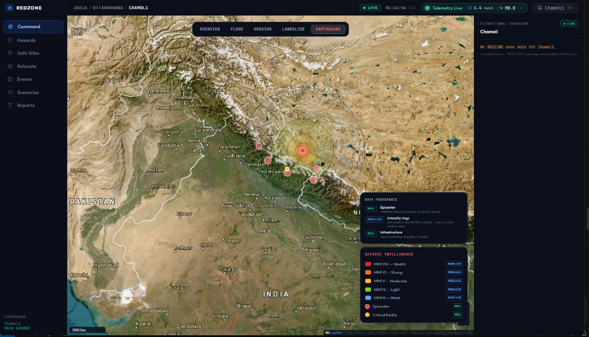

# REDZONE: General-Purpose Multi-Hazard Relocation Decision Engine



**REDZONE** is a **region-agnostic**, enterprise decision-support and relocation engine for disaster-management authorities (NDRF, SDMA, DDMA). It ingests any geography via a `regions` table and runs identical multi-hazard scoring everywhere — no region-specific code.

> *"Existing systems display where disasters are occurring. REDZONE answers the operational imperatives: **WHO** is at risk, **WHY** they are endangered, **WHERE** they can safely relocate, and **HOW** evacuation and resource allocation must be executed."*

**Pilot regions loaded:** Assam Multi-District (Majuli, Dhemaji, Cachar — flood + erosion) and Chamoli, Uttarakhand (landslide + subsidence). Adding a new region requires only a seed script — no core code changes.

---

## 🔄 The Core Operational Loop

REDZONE transitions disaster operations into structured, explainable execution:

$$\text{DETECT} \longrightarrow \text{ASSESS} \longrightarrow \text{PRIORITIZE} \longrightarrow \text{MATCH} \longrightarrow \text{ROUTE} \longrightarrow \text{RELOCATE} \longrightarrow \text{AUDIT}$$

1. **DETECT**: Ingests real-time geographic telemetry (OpenStreetMap waterways, USGS seismic catalogs, OWM rainfall) per active region — auto-polling starts when a region is added to the DB.
2. **ASSESS**: Computes multi-factor hazard scores + **seasonal risk multiplier** (Gaussian peak-month weighting from DisasterHistory) with verifiable provenance tags (`REAL`, `SYNTH`, `MISSING`).
3. **PRIORITIZE**: Classifies exposed habitations into four **RelocationHorizon** buckets (`IMMEDIATE`, `SHORT_TERM`, `MEDIUM_TERM`, `MONITOR`) using hazard score + **vulnerability index** (elderly %, literacy, housing type, household size, BPL fraction). `IMMEDIATE` is never silently downgraded for lack of a matched site.
4. **MATCH**: Allocates displaced populations to verified Safe Sites using NBC 2016 shelter standards (min. 9.5 m²/person), deducting `committed_population` from available capacity. `hazard_free=False` sites are excluded.
5. **ROUTE**: Evaluates evacuation corridors via OSRM road network integration.
6. **RELOCATE**: Generates field-ready **Deployment Manifests** (POST `/api/manifest`) with NDRF team / truck / medical unit counts, auto-scaled by vulnerability index.
7. **AUDIT**: Every score carries a structured `explanation_json` (§6 audit trail) with terrain source, signal status, seasonal multiplier, vulnerability breakdown, and horizon rationale.

---

## 🛰 Multi-Hazard GIS Architecture

REDZONE features a dedicated GIS layer stack tailored to four primary disaster modalities:

### 1. Flood Inundation (`FLOOD`)
- **Centerline Geometry**: Real OpenStreetMap hydrology (rivers, canals, tributaries).
- **Inundation Buffers**: Dual-zone hydrodynamic approximation (2 km outer extent, 800 m high-depth zone).
- **Infrastructure Impact**: Identification of submerged bridges, vulnerable road links, and flooded community centers.

### 2. Riverbank Erosion (`EROSION`)
- **Active Channel**: Primary high-energy river thalweg.
- **Active Erosion Band**: 150 m high-intensity near-bank vulnerability buffer.
- **Projection Corridor**: 500 m modelled retreat zone identifying threatened settlements and compromised bridge abutments.

### 3. Slope Failure & Landslide (`LANDSLIDE`)
- **Susceptibility Zones**: Hazard score-proportional irregular terrain polygons.
- **Transport Vulnerability**: Detection of arterial roads intersecting high-susceptibility slope corridors.
- **Honest Provenance**: Explicit declaration of DEM/slope raster absence when satellite radar data is unavailable.

### 4. Seismic Impact (`EARTHQUAKE`)
- **USGS Real-Time Integration**: Live query of seismic events ($\ge M3.5$) within regional radius.
- **Modified Mercalli Intensity (MMI)**: Attenuation-based contour rings from MMI VII+ (Severe) to MMI III (Weak).
- **Impact Radius**: Pulsating epicenter beacon and radial structural risk assessment.

---

## 🧠 Algorithmic Scoring & Explainable AI (XAI)

### 1. Habitation Urgency Index
$$\text{Urgency Score} = H_{\text{score}} \times P_{\text{exposure\_norm}} \times F_{\text{site}}$$
- **Hazard Score** ($H_{\text{score}}$): Weighted composite of intensity, history, terrain, proximity, SAR deformation, NDVI change × live trigger multiplier.
- **Seasonal Risk Multiplier** (§2.5): Gaussian peak-month weighting from DisasterHistory event_date distribution; range 1.0–2.0.
- **Population Exposure Norm** ($P_{\text{exposure\_norm}}$): Fraction of reference population (5,000) exposed; floor applied when habitation is fully within hazard zone.
- **Site Availability Factor** ($F_{\text{site}}$): 1.0 if a viable site exists within radius; 0.6 otherwise (still visible, not hidden).

### 2. Social Vulnerability Index (§2.1)
$$V = 0.25 \cdot e_{\text{elderly}} + 0.20 \cdot (1-l_{\text{literacy}}) + 0.25 \cdot h_{\text{kutcha}} + 0.15 \cdot hh_{\text{size}} + 0.15 \cdot b_{\text{bpl}}$$
Proxies from Census 2011 / SECC 2011. Surfaced with vintage warning in every API response.
High vulnerability ($V \ge 0.75$) at MEDIUM_TERM hazard elevates horizon to SHORT_TERM.

### 3. Relocation Horizon Classification (§2.2)
| Threshold | Horizon | Authority Action |
|---|---|---|
| $H \ge 0.75$ | `IMMEDIATE` | NDRF deployment ≤ 24h; never silently downgraded |
| $H \in [0.55, 0.75)$ | `SHORT_TERM` | Infrastructure prep + community consent (weeks–1 yr) |
| $H \in [0.35, 0.55)$ | `MEDIUM_TERM` | Formal DPR + seasonal re-assessment (1–3 yr) |
| $H < 0.35$ | `MONITOR` | Sensor + satellite observation only |

### 4. Deployment Manifest (§2.7)
POST `/api/manifest` → returns NDRF/SDRF team count, trucks, medical units scaled by population + vulnerability.  
GET `/api/manifest/{id}/pdf` → PDF via fpdf2 for briefings.

### 2. Safe Site Capacity Index (NBC 2016 Compliant)
$$\text{Capacity Score} = 0.30 \cdot L_{\text{avail}} + 0.25 \cdot S_{\text{safety}} + 0.20 \cdot I_{\text{prox}} + 0.15 \cdot W_{\text{access}} + 0.10 \cdot (1 - \text{Load Ratio})$$
- **Land Availability ($L_{\text{avail}}$)**: Verified usable area divided by NBC 2016 standard ($9.5\text{ m}^2/\text{person}$).
- **Slope Safety ($S_{\text{safety}}$)**: Terrain gradient within safe habitation envelope ($< 20^\circ$).
- **Infrastructure Proximity ($I_{\text{prox}}$)**: Distance to primary road network ($< 5\text{ km} = 1.0$).
- **Water Access ($W_{\text{access}}$)**: Proximity to potable water networks.
- **Load Headroom**: Remaining unallocated shelter capacity.

---

## 🛠 Platform Modules

| Module | Purpose | Key Capabilities |
| :--- | :--- | :--- |
| **Command Center** | Situational Awareness | Real-time map, P0–P2 priority triage queue, stressor breakdown. |
| **Safe Site Intelligence** | Shelter Matching | NBC 2016 capacity audits, terrain safety scoring, live OSRM route computation. |
| **Relocation Planner** | Operational Execution | 4-step wizard: Selection $\rightarrow$ Allocation $\rightarrow$ Logistics $\rightarrow$ Deployment Manifest. |
| **Scenario Lab** | Predictive Simulation | What-if modeling (rainfall +mm, river surge +m, erosion rate $\Delta$) with +48h projections. |
| **Events & Historical Replay**| Forensic Analysis | Scrub through historical disaster timelines to audit systemic response efficacy. |
| **Incident Reports** | Accountability & Records | Searchable archive of generated deployment manifests and post-action audit trails. |

---

## 🏗 System Architecture & Technology Stack

```
redzone/
├── backend/                  # FastAPI Application
│   ├── api/                  # Modular endpoints (zones, sites, events, scenario, areas)
│   ├── scoring/              # Core math engines (capacity_engine, hazard_engine, matching_optimizer)
│   ├── models.py             # SQLAlchemy models & schema definitions
│   └── main.py               # Application entrypoint & middleware
└── frontend/                 # React 18 + Vite SPA
    ├── src/
    │   ├── api/              # Client API, Overpass multi-mirror failover, OSRM routing
    │   ├── components/       # HazardMap, MapInspectorPanel, HazardLegend, GlobalSearch
    │   ├── context/          # AppStore (state machine) & AreaContext
    │   └── pages/            # CommandCenter, SafeSiteIntelligence, RelocationPlanner, etc.
```

- **Frontend**: React 18, Vite, Vanilla CSS + Tailwind utility layer, Leaflet GIS, Framer Motion.
- **Backend**: Python 3.11+, FastAPI, SQLAlchemy, SQLite/PostGIS, Pydantic v2.
- **Telemetry**: OpenStreetMap Overpass API (multi-mirror with failover cache), USGS Earthquake API, OSRM Routing.

---

## 🚀 Quickstart Guide

### Prerequisites
- Node.js (v18+)
- Python (3.10+)

### 1. Start the Backend API
```bash
cd backend
python -m venv venv
# On Windows:
venv\Scripts\activate
# On Linux/macOS:
source venv/bin/activate

pip install -r requirements.txt
uvicorn main:app --reload --port 8000
```

### 2. Start the Frontend Application
```bash
cd frontend
npm install
npm run dev
```
Open [http://localhost:5173](http://localhost:5173) in your browser.

---

## 🔒 Data Provenance & Reliability Contract

REDZONE adheres to strict truth-in-data principles:
- **No Hallucinated Data**: Every visual entity displays a provenance badge (`REAL`, `MODELLED`, `RECONSTRUCTED`, `UNAVAILABLE`).
- **Fail-Safe Offline Mode**: If external OSM Overpass servers are rate-limited or unreachable, the system automatically falls back to local high-resolution pilot corridor telemetry without freezing the interface.
- **Auditable AI**: No black-box decisions; all recommendations are fully decomposed into weighted mathematical factors.

---

*Built for Smart India Hackathon 2026 · Risk-Aware Relocation Platform*
